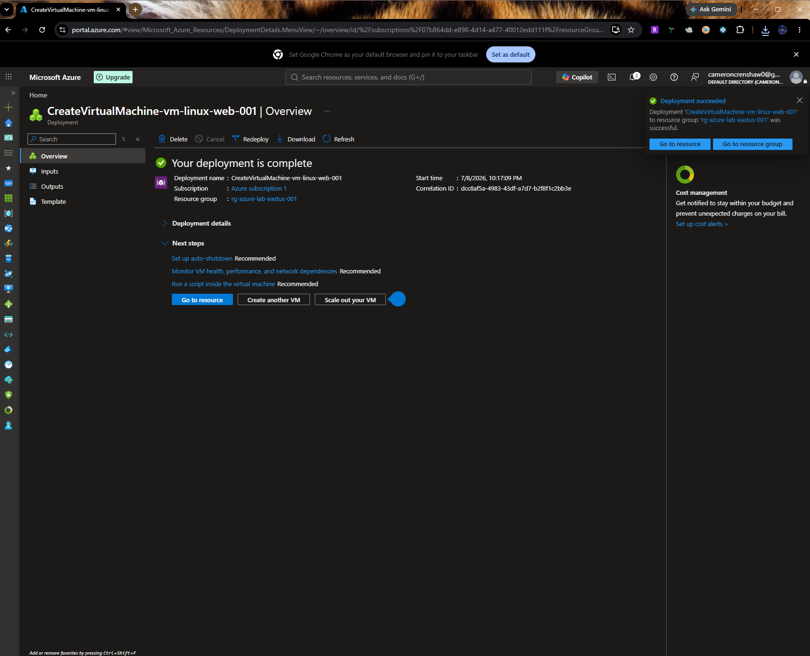
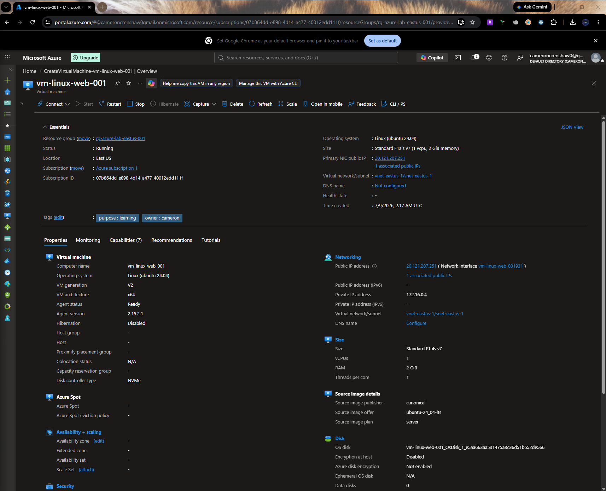
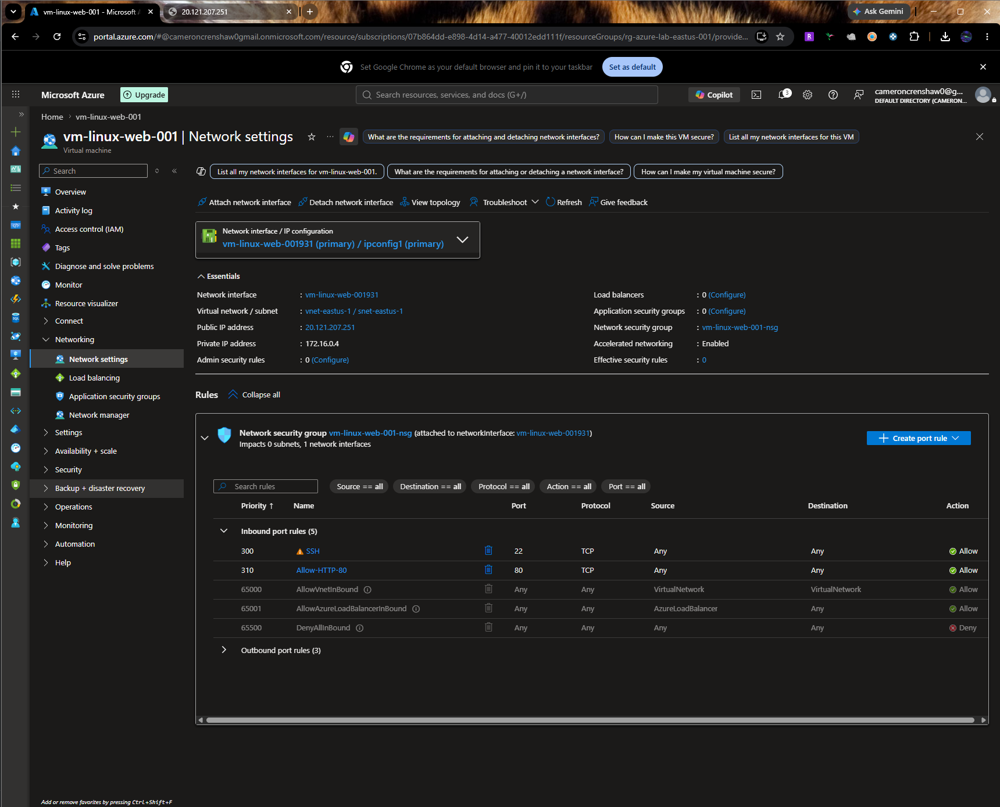
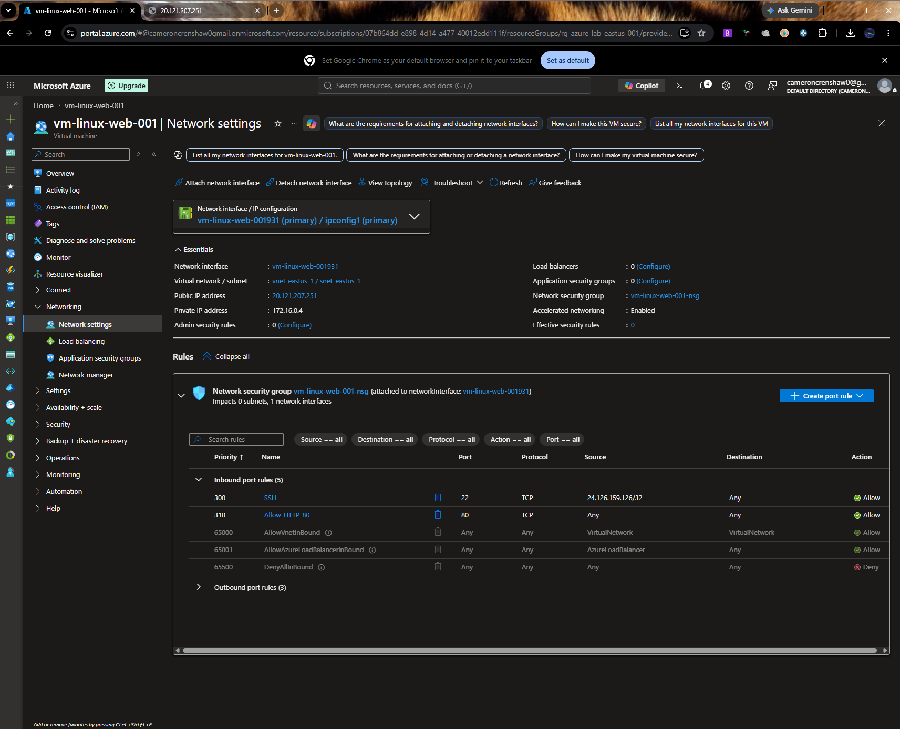
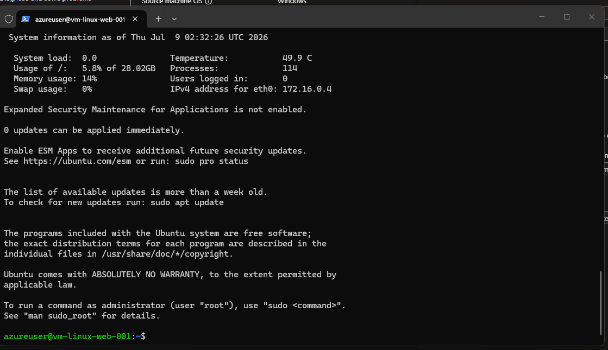
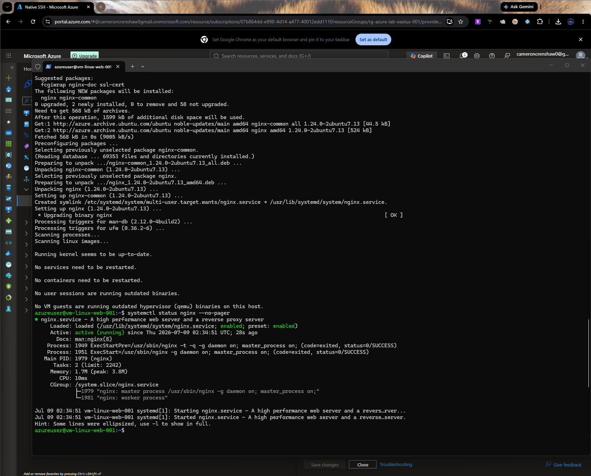

# Azure Linux VM on Azure

I deployed an Ubuntu Linux virtual machine in Microsoft Azure, connected to it over SSH with key-based authentication, installed Nginx, and published a custom landing page. I also configured network security rules so SSH is restricted to my home public IP while HTTP stays open for the website.

## Azure resources used

- Virtual machine: `vm-linux-web-001`
- Resource group: `rg-azure-lab-eastus-001`
- Virtual network: `vnet-eastus-1`
- Subnet: `snet-eastus-1`
- Network security group: `vm-linux-web-001-nsg`
- Public IP: `20.121.207.251`

## What this demonstrates

- Azure virtual machine creation
- Linux administration
- SSH key-based authentication
- Azure NSG rule management
- Basic web server deployment
- Public website verification

## Security choices

- SSH is restricted to my home public IP: `24.126.159.126/32`
- HTTP port 80 is open so the website can be reached from a browser
- The VM was stopped and deallocated after testing to avoid compute charges

## Verification

- SSH session established successfully from my local Windows machine
- `nginx` installed and running
- Browser reached the VM over HTTP
- Custom landing page loaded successfully

## Screenshots














## Commands used

```bash
sudo apt update
sudo apt install nginx -y
systemctl status nginx --no-pager
echo '<h1>Deployed by Cameron Crenshaw</h1><p>Azure Linux VM lab</p>' | sudo tee /var/www/html/index.html

ssh -i $HOME\.ssh\vm-linux-web-001_key.pem azureuser@20.121.207.251
